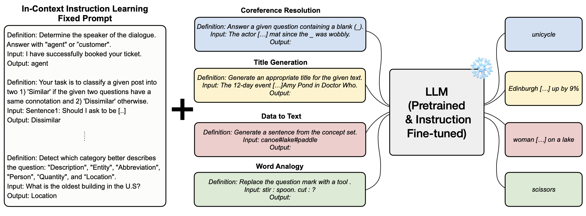
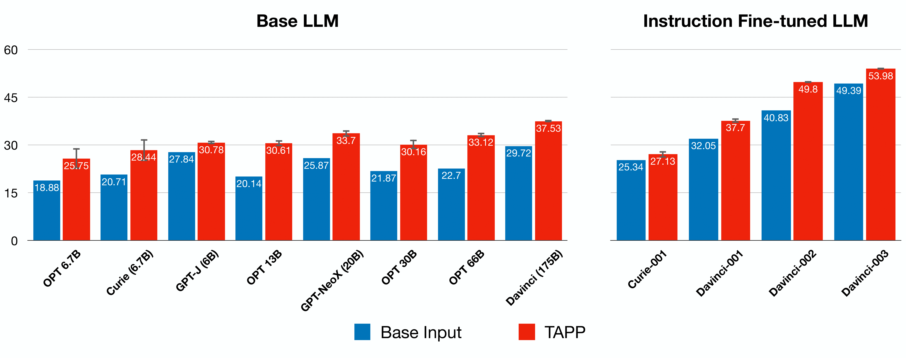

# In-Context Instruction Learning (ICIL)
This is the official github repository for [In-Context Instruction Learning](https://arxiv.org/abs/2302.14691).


Overview of In-Context Instruction Learning (ICIL)

<p align="center">
  
</p>


## Dataset
For evaluation dataset, we used SuperNatural-Instructions, which can be assessed in the official [repo](https://github.com/allenai/natural-instructions). Simply clone the repo under this directory and change the directory name to `data`. We run our main experiments on the 119 tests tasks designated by this official repository. We also randomly selected  100 instances (at maximum) per each of these tasks.


## Setting 
The following command will clone the project: 
```
git clone https://github.com/seonghyeonye/ICIL.git
```

Before experimenting, you can make a virtual environment for the project.
```
conda create -n zeroshotlm python=3.8
conda activate zeroshotlm
pip install -r requirements.txt
```

## Run  
You can run inference with various prompting schemes by running files under `scripts/gpt3` or `scripts/decoder`. For instance, if you want to test our ICIL prompt on GPT-3 (davinci) for 119 Test tasks from SuperNatural-Instructions, you can run
```scripts/gpt3/run_ICIL.sh ```


Result of In-Context Instruction Learning (ICIL)
<p align="center">
  
</p>


### Irrelevant ICIL
For Irrelevant ICIL, we randomly corrupt input sentences from the prompts with sentences from `cc_news`. To access this file, please visit our [google drive](https://drive.google.com/file/d/1Rl3jzQqNvP2Jzics9N4rhm1eF3pj5gix/view?usp=share_link). we have downloaded the huggingface `cc_news` dataset from [here](https://huggingface.co/datasets/cc_news) and parsed using `en_core_sm` from `spacy` and made it into a .txt file comprised of its sentences.

But under `demo` directory, we have all the `irr_ICIL` demos already extracted, so instead, you can run `run_ICIL.sh`(instaed of `run_irr_ICIL.sh`) after you change the *--demo_path* option.


## Experiments
To replicate our experiments in the paper, please refer to the following resources:

- **Figure 1,4**
    - run files under `scripts/gpt3` for GPT3 API based models. 
        - change the model type name by changing `for engine in "davinci"` code snippet to `for engine in {your model}`
    - run files under `scripts/decoder` for models run with GPU. 
        - change the model type name by changing `--model_name_or_path facebook/opt-30b` code snippet to `--model_name_or_path {your model}`)
- **Table 1**
    - run `scripts/gpt3/run_ICIL.sh` with --demo_path:
        - `demos/analysis/distribution/irr_inst.json` for Random Instruction,
        - `demos/irr_ICIL/irr_ICIL_seed1.json` for Random Input,
        - `demos/analysis/distribution/irr_output.json` for Random Output.
- **Figure 5**
    - run `scripts/gpt3/run_ICIL.sh` and
        - For (a): use demos in `demos/analysis/classification`
        - For (b): use demos in `demos/analysis/shot`.
        - For (c): use demos in `demos/random_ordering_ICIL`.
- **Table 2**
    - run `scripts/gpt3/run_ICIL.sh` with --demo_path `demos/analysis/answer_choice_overlap/eight_overlap_mixed.json.` for Overlap Setting.
- **Figure 6**
    - For (a), run `scripts/gpt3/run_ICIL.sh` and use demo in `demos/analysis/chatgpt/chatgpt.json` for Generated.
    - For (b), run files under `scripts/ablation`. Note that this may take some time before starting the inference process.

## OpenAI API
For experiments with GPT-3 models (curie, davinci, text-curie, text-davinci), you should have a OpenAI API key, which can be applied [here](https://platform.openai.com/). After acquiring the key, insert your API key on ```export openai_key=""``` for each of the script file in ```scripts``` directory.

## Acknowledgements
Our code repository is mainly based on [Tk-Instruct](https://github.com/yizhongw/Tk-Instruct). Special thanks to the contributors of the repository!

## Citations
```
@article{ye2023context,
  title={In-Context Instruction Learning},
  author={Ye, Seonghyeon and Hwang, Hyeonbin and Yang, Sohee and Yun, Hyeongu and Kim, Yireun and Seo, Minjoon},
  journal={arXiv preprint arXiv:2302.14691},
  year={2023}
}
```
